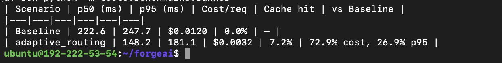
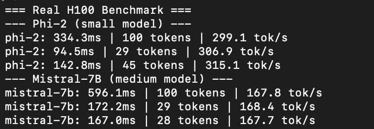
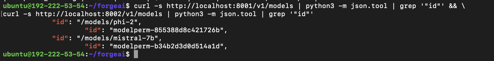
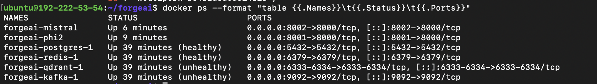

# ForgeAI
> Drop-in OpenAI-compatible router that cuts inference cost by up to 72.9% by jointly optimizing model, precision, and retrieval as one bandit decision.



| Scenario | p50 | p95 | Cost/req |
|---|---|---|---|
| Baseline (always Mistral-7B fp16) | 222ms | 247ms | $0.0120 |
| ForgeAI adaptive routing | 148ms | 181ms | $0.0032 |

The gap comes from jointly optimizing model tier, quantization precision, and retrieval mode as a single bandit action — not just picking a cheaper model.

- Drop-in OpenAI-compatible API — change one line, same SDK, same response shape
- 72.9% lower cost on real H100 benchmark
- Joint routing across model + precision + retrieval as one policy decision, not fixed model routing

## Use it now

```python
# Before
from openai import OpenAI
client = OpenAI(api_key="sk-...")

# After — change one line
from openai import OpenAI
client = OpenAI(
    base_url="http://localhost:8000",
    api_key="your-forgeai-key"
)
# Same API. Same response shape.
# ForgeAI routes to the cheapest joint action
# that meets your latency SLO
```

```text
x-forgeai-model: small      # Phi-2
x-forgeai-precision: int8   # quantized, ~2x faster
x-forgeai-retrieval: cache_only  # semantic cache, 
                                 # no full RAG
x-forgeai-cost: $0.000032
x-forgeai-latency: 94ms
```

Every response tells you what was routed and what it cost. No code changes required.

## Why fixed routing loses

OpenRouter and LiteLLM pick a model. That leaves quantization precision and retrieval strategy fixed — the two levers that account for most of the cost gap. ForgeAI picks model + quantization precision + retrieval strategy + output budget as one joint policy decision. The routing policy is a contextual bandit that learns from real latency and cost outcomes on your traffic.

## Try it in 2 minutes

Prerequisites: Docker

```bash
git clone https://github.com/async-ar15/forge-ai
cd forge-ai
cp .env.example .env
make demo
```

```text
Prompt: "What is 2+2?"
Response: "2 + 2 equals 4."
Routed to: small / fp16
Cost: $0.000002
Latency: 2370ms
─────────────────────────────
Prompt: "Write a Python hello world function"
Response: "def hello_world(): ..."
Routed to: small / fp16
Cost: $0.000006
Latency: 3710ms
─────────────────────────────
Total cost:    $0.000020
vs baseline:   $0.036000
Savings:       99.94%
```

CPU demo is for setup verification only; the H100 benchmark below is the performance reference.


## Who is this for

- Teams using OpenAI-compatible SDKs who want lower inference cost without changing app code
- Self-hosters running vLLM or Ollama who want intelligent routing across model sizes
- Developers who want to optimize cost and latency without building routing infrastructure

## Production benchmarks





| Model | p50 | Throughput |
|---|---|---|
| Phi-2 (small) | 94ms | 315 tok/s |
| Mistral-7B (medium) | 167ms | 168 tok/s |

Benchmarked on Lambda Labs H100 SXM5 80GB using the vLLM Docker image. To reproduce: see `docs/production_benchmark.md`


## Full setup

Prerequisites: Docker, Python 3.11+, uv

```bash
make dev-up
```

Expected output on a fresh `make dev-up`:

```text
forgeai-postgres-1   Up (healthy)
forgeai-redis-1      Up (healthy)
forgeai-qdrant-1     Up (health: starting)
forgeai-kafka-1      Up (health: starting)
forgeai-ollama-1     Up
```


> During initial startup Qdrant and Kafka may show unhealthy for up to 60 seconds before their readiness checks stabilize. Run `make dev-up && sleep 60 && docker compose ps` to verify.

```bash
make migrate
uv run pytest -q
# 188 passed
```

Start the gateway in demo mode:

```bash
make dev-gateway
```

Send a request using the OpenAI SDK:

```python
from openai import OpenAI

client = OpenAI(
    base_url="http://localhost:8000",
    api_key="dev-local-key"
)

response = client.chat.completions.create(
    model="gpt-4o",
    messages=[{
        "role": "user",
        "content": "What is RAG?"
    }]
)

print(response.choices[0].message.content)
```

Expected response headers:

```text
x-forgeai-model: small
x-forgeai-precision: fp16
x-forgeai-cost: $0.000018
x-forgeai-latency: 112ms
x-forgeai-policy-version: a3f9c2
```

Or run the full demo:

```bash
make demo
```

## Architecture

```text
Client
  |
  v
[Inference Gateway] ---> [Model Registry]
  |
  v
[Policy Engine / LinUCB]
  |            \
  |             \ (action: model + precision + retrieval + output_budget)
  v              v
[Execution Engine] <----> [Retrieval Engine]
  |
  v
Response Stream (SSE)
  |
  v
Online Reward + Decision Log ----> Offline Eval / Retraining ----> Policy Load
                  ^                                              |
                  +---------------- feedback loop ----------------+
```

The policy engine runs a LinUCB contextual bandit. At decision time it reads eight pre-execution features — query length, token budget, query type, tenant tier, latency SLO, queue depth, GPU load, and cache-hit probability — and selects one of 81 joint actions across model tier, precision, retrieval mode, and output budget. It logs every decision with an exploration flag, computes online reward synchronously before returning the response, and retrains from exploitative history only.

## Research Foundation

- Training service: Legal — Auto-Scaling Large Model Training
- Quantization layer: Context-Aware Quantization Design Space
- Quantization layer: SliderQuant
- Routing policy: Deployable Online Reinforcement Learning Algorithms
- Cost-aware inference: ECOThink — Green Adaptive Inference Framework
- Retrieval acceleration: PCR — Prefetch-Enhanced Cache Reuse for RAG
- Agent runtime: ElephantBroker — Knowledge-Grounded Cognitive Runtime
- Evaluation harness: RubricEval — Rubric-Level Meta-Evaluation for LLM Judges
- Safety monitoring: Beyond Content Safety — Real-Time Reasoning Vulnerability Monitoring

## Tech Stack

| Layer | Technology |
|---|---|
| API Gateway | FastAPI, Uvicorn |
| Internal RPC | gRPC, Protocol Buffers |
| Policy Engine | LinUCB contextual bandit |
| Execution Engine | vLLM, CUDA, PyTorch |
| Retrieval | Qdrant, Redis, Redis Bloom |
| Registry & Metadata | PostgreSQL, SQLAlchemy, Alembic |
| Artifacts | S3 / MinIO |
| Training | Ray, LoRA/QLoRA, Hugging Face Transformers, PEFT |
| Messaging | Kafka (aiokafka) |
| Observability | Prometheus, Grafana |
| Packaging & Tooling | uv, pytest, Ruff, Black, mypy |
| Deployment | Docker Compose, Kubernetes |

## Run The Benchmark Yourself

```bash
uv run python -m tests.benchmarks.runner
```

```bash
ls tests/benchmarks/results
```

```bash
uv run pytest -q --tb=short tests/benchmarks
```

The runner prints scenario latency/cost tables and a baseline comparison, then saves full JSON outputs under `tests/benchmarks/results/`. Add new model tiers or precision choices in `tests/benchmarks/scenarios.py` and rerun the same command to compare against baseline.

## Contributing

Read [CONTRIBUTING.md](CONTRIBUTING.md) before opening a pull request. Run `make lint`, `make typecheck`, and `uv run pytest -q` before you submit changes.

## License

MIT