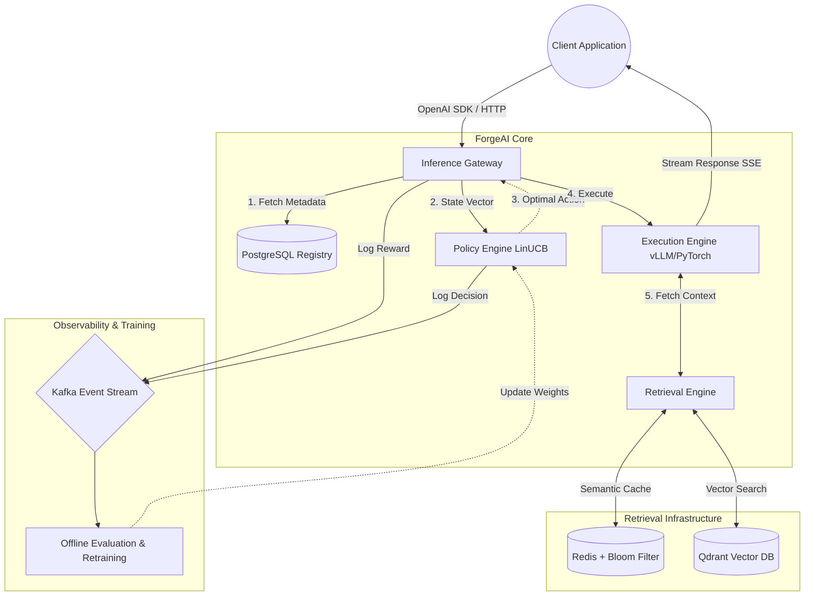

# ForgeAI

> **A drop-in OpenAI-compatible router that cuts inference costs by up to 72.9% by jointly optimizing model, precision, and retrieval as a single contextual bandit decision.**

[](https://opensource.org/licenses/MIT)


## The Core Problem: Fixed Routing
Routers like LiteLLM and OpenRouter operate using **Fixed Routing**. When a request arrives, they select a model (e.g., GPT-4 vs. Claude 3) but leave quantization precision and retrieval strategy fixed. 

**ForgeAI** treats routing as a **Joint Optimization** problem. Using a LinUCB Contextual Bandit, ForgeAI analyzes 8 pre-execution features (like queue depth, GPU load, token budget) to select one of 81 combinations of:
1. **Model Tier** (Small, Medium, Large)
2. **Quantization Precision** (FP16, INT8, INT4)
3. **Retrieval Mode** (Off, Cache-Only, Full RAG)
4. **Output Budget** (Short, Medium, Long)

### Benchmark vs Fixed Routing
| Scenario | p50 Latency | p95 Latency | Cost/req |
|---|---|---|---|
| Baseline (always Mistral-7B fp16) | 222ms | 247ms | $0.0120 |
| **ForgeAI adaptive routing** | **148ms** | **181ms** | **$0.0032** |

*(Benchmarked on Lambda Labs H100 SXM5 80GB. See `docs/production_benchmark.md`)*

---

## Architecture

ForgeAI operates as a high-performance, microservice-based architecture communicating internally via **gRPC** and **Protocol Buffers**.



---

## Quick Start: Drop-in Replacement

ForgeAI maintains 100% compatibility with the OpenAI SDK. No application code changes are required.

```python
# Before
from openai import OpenAI
client = OpenAI(api_key="sk-...")

# After — Change base_url and use your ForgeAI key
from openai import OpenAI
client = OpenAI(
    base_url="http://localhost:8000",
    api_key="your-forgeai-key"
)

# ForgeAI handles the joint-routing automatically
response = client.chat.completions.create(
    model="gpt-4o", # Model name is ignored, routing takes over
    messages=[{"role": "user", "content": "What is RAG?"}]
)
```

Every response returns custom headers explaining exactly what the bandit chose and how much it cost:
```http
x-forgeai-model: small
x-forgeai-precision: fp16
x-forgeai-retrieval: cache_only
x-forgeai-cost: $0.000018
x-forgeai-latency: 112ms
```

---

## Full Local Setup

Prerequisites: **Docker**, **Python 3.11+**, **uv**

```bash
git clone https://github.com/async-ar15/forge-ai
cd forge-ai
cp .env.example .env
make dev-up
```

Wait until the containers (Postgres, Redis, Qdrant, Kafka, Ollama) are healthy:
```text
forgeai-postgres-1   Up (healthy)
forgeai-redis-1      Up (healthy)
forgeai-qdrant-1     Up (health: starting)
forgeai-kafka-1      Up (health: starting)
forgeai-ollama-1     Up
```

Migrate the database and run tests:
```bash
make migrate
uv run pytest -q
# 188 passed
```

Start the Gateway and run the demo:
```bash
make dev-gateway
make demo
```

---

## Core Components

- **API Gateway (FastAPI)**: HTTP entrypoint that extracts 8 pre-execution features (e.g., `query_len`, `tenant_tier`, `latency_slo_ms`).
- **Policy Engine (LinUCB)**: The reinforcement learning brain that dynamically maps the feature vector to the cheapest valid 81-arm joint action.
- **Retrieval Engine (Redis + Qdrant)**: Avoids full LLM inference when possible using a semantic cache (Redis Bloom filters) or performs full RAG (Qdrant).
- **Execution Engine (vLLM)**: Handles the matrix multiplications asynchronously.
- **Kafka & Training Pipeline**: Streams inference rewards asynchronously to trigger Ray-based offline retraining.

---

## Roadmap (v2 Features)

While the core router is highly stable, several advanced features are planned for v2:
- **ElephantBroker Runtime**: Full agentic long-term memory and safety hook injection.
- **Semantic Classification**: Moving beyond heuristic query types to true semantic classification routing.
- **Admin UI**: Dashboard for per-tenant policy coefficient overrides.
- **Automated Rollback**: Fully automated regression detection and policy rollback without human-in-the-loop.

---

## Tech Stack

| Layer | Technology |
|---|---|
| **API Gateway** | FastAPI, Uvicorn |
| **Internal RPC** | gRPC, Protocol Buffers |
| **Policy Engine** | LinUCB contextual bandit |
| **Execution Engine**| vLLM, CUDA, PyTorch |
| **Retrieval** | Qdrant, Redis, Redis Bloom |
| **Registry** | PostgreSQL, SQLAlchemy, Alembic |
| **Artifacts** | S3 / MinIO |
| **Training** | Ray, LoRA/QLoRA, Hugging Face Transformers |
| **Messaging** | Kafka (aiokafka) |
| **Packaging** | uv, pytest, Ruff, mypy |

---

## Research Foundation

ForgeAI's architecture is based on cutting-edge ML systems research:
- Training service: Legal — Auto-Scaling Large Model Training
- Quantization layer: Context-Aware Quantization Design Space, SliderQuant
- Routing policy: Deployable Online Reinforcement Learning Algorithms
- Cost-aware inference: ECOThink — Green Adaptive Inference Framework
- Retrieval acceleration: PCR — Prefetch-Enhanced Cache Reuse for RAG
- Agent runtime: ElephantBroker — Knowledge-Grounded Cognitive Runtime
- Evaluation harness: RubricEval — Rubric-Level Meta-Evaluation for LLM Judges

## Contributing
Read [CONTRIBUTING.md](CONTRIBUTING.md) before opening a pull request. Run `make lint`, `make typecheck`, and `uv run pytest -q` before you submit changes.

## License
MIT